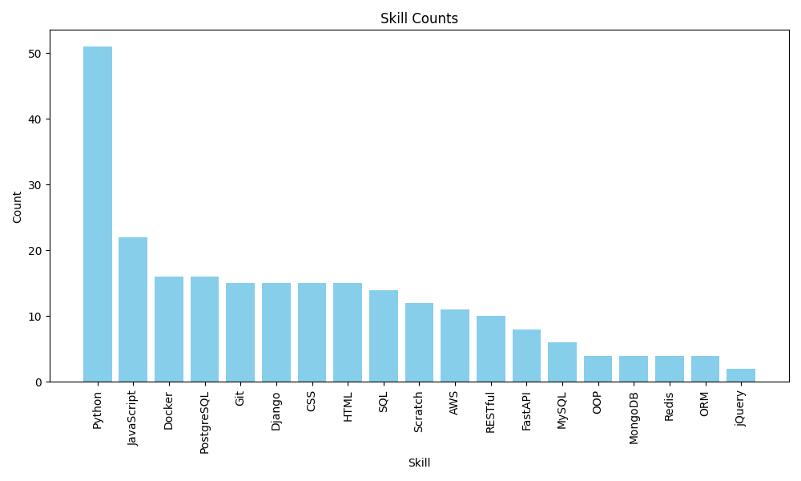

# Technology Job Scraper

## Overview 🔎

This project is a web scraper built using the Scrapy framework to scrape job listings for Python-related positions from
job search website. The scraper extracts job titles, skills required, and job URLs, then processes and analyzes the
data using pandas to determine the frequency of different skills mentioned in job listings.

## Prerequisites 🐍

- Python 3.8+
- Scrapy
- pandas
- matplotlib
- python-dotenv

The project requires certain environment variables to be set. You can create a `.env` file in the root directory of your
project and add the following variables:

```env
TECHNOLOGIES=your_technologies
```

## Setup 🔧

1. Clone the repository:

   ```bash
   git clone https://github.com/yourusername/technology-job-scraper.git
   cd technology-job-scraper


2. Create and activate a virtual environment

   ```bash
   python -m venv venv
   source venv/bin/activate  # On Windows, use `venv\Scripts\activate`


3. Install the dependencies

   ```bash
   pip install -r requirements.txt

4. Set up the environment variables

    - Create a .env file in the project root directory and add your configuration:
   ```bash
   TECHNOLOGIES=Python,SQL,Django,Flask,AWS,Docker,JavaScript...
   

## Usage 🚀

1. Run the Scrapy spider

   ```bash
   scrapy crawl technology -O technologies.csv  
   
This will scrape the job listings and save the data to technologies.csv.

2. Analyze the data 

   - Open the technologiesAnalytic.ipynb Jupyter notebook to analyze and visualize the data.


## Contact 💌

For any inquiries, please contact [vitalinamalinovskaya557@gmail.com](mailto:vitalinamalinovskaya557@gmail.com).

## Demo

